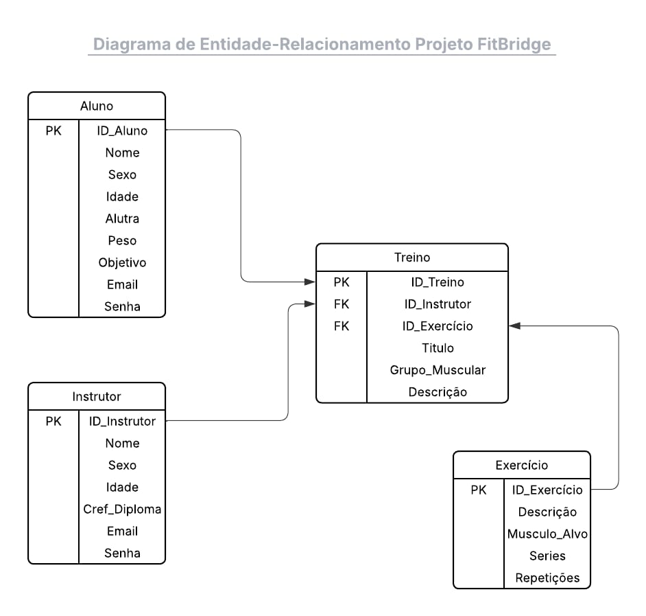
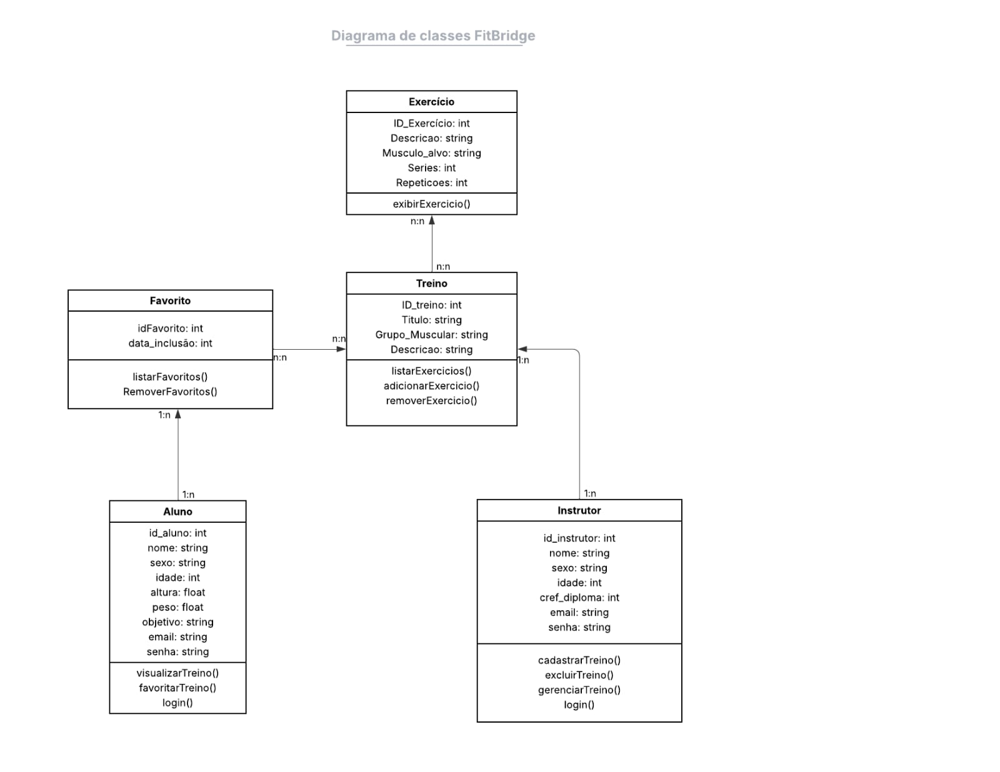
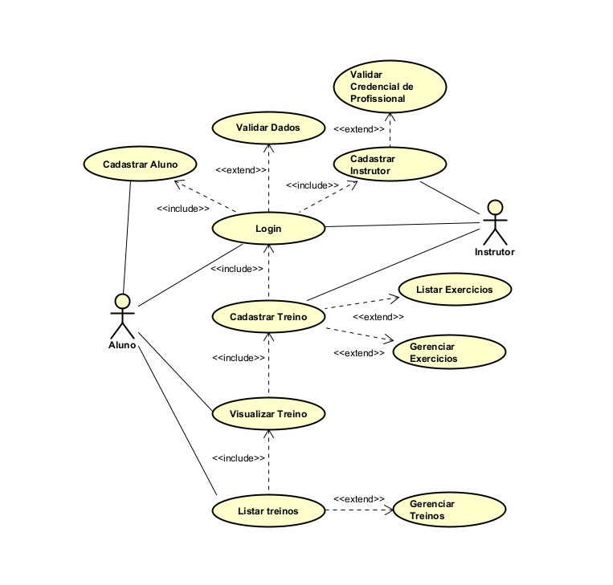

# FitBridge

## Plataforma web para organização e compartilhamento de treinos

O **FitBridge** é um projeto acadêmico de Engenharia de Software voltado à disponibilização de informações sobre exercícios físicos e planos de treino. A plataforma busca aproximar usuários e profissionais, oferecendo recursos para cadastro, consulta, organização e gerenciamento de treinos.

O projeto evoluiu em etapas que envolveram levantamento de requisitos, definição de regras de negócio, elaboração de algoritmos, modelagem do sistema, prototipação das interfaces, desenvolvimento de uma API REST e criação de uma aplicação web.

> **Aviso:** o FitBridge é um projeto acadêmico e não substitui avaliação, diagnóstico, prescrição ou acompanhamento de profissionais habilitados das áreas de saúde e educação física.

---

## Sumário

- [Visão geral](#visão-geral)
- [Objetivos](#objetivos)
- [Escopo atual](#escopo-atual)
- [Públicos e atores do sistema](#públicos-e-atores-do-sistema)
- [Funcionalidades](#funcionalidades)
- [Arquitetura da solução](#arquitetura-da-solução)
- [Tecnologias](#tecnologias)
- [Diagramas do projeto](#diagramas-do-projeto)
- [Prototipação](#prototipação)
- [API REST](#api-rest)
- [Dados iniciais para testes](#dados-iniciais-para-testes)
- [Repositórios](#repositórios)
- [Equipe](#equipe)
- [Situação do projeto](#situação-do-projeto)

---

## Visão geral

A proposta do FitBridge surgiu da necessidade de tornar mais acessíveis conteúdos organizados sobre treinamento físico. A solução prevê uma interface simples para que usuários possam consultar treinos e salvar conteúdos de interesse, enquanto profissionais possam cadastrar e gerenciar planos e exercícios.

A concepção original também considera personalização por perfil, recomendações, filtros, validação profissional, conteúdos de nutrição e exportação de planos em PDF. Esses itens fazem parte da visão ampliada do projeto e podem ser desenvolvidos em etapas futuras. O escopo técnico atual está concentrado principalmente em **exercícios**, **treinos**, **alunos**, **instrutores** e **favoritos**.

---

## Objetivos

### Objetivo geral

Desenvolver uma plataforma web capaz de organizar e disponibilizar treinos e exercícios, oferecendo uma experiência acessível para consulta e gerenciamento das informações.

### Objetivos específicos

- Permitir o cadastro e a autenticação de alunos e instrutores.
- Permitir que instrutores cadastrem e gerenciem treinos.
- Organizar exercícios por descrição e músculo-alvo.
- Permitir que alunos consultem os treinos disponíveis.
- Permitir que alunos salvem treinos como favoritos.
- Integrar uma interface web com uma API REST.
- Estruturar o projeto com base em requisitos, diagramas e protótipos.
- Manter uma base para futuras funcionalidades de recomendação e personalização.

---

## Escopo atual

O sistema está dividido em duas aplicações principais:

1. **Back-end:** API responsável pelas regras de negócio, persistência e disponibilização dos dados.
2. **Front-end:** interface web responsável pela interação com alunos e instrutores.

As entidades centrais do escopo atual são:

- **Aluno:** usuário que consulta treinos e gerencia favoritos.
- **Instrutor:** profissional responsável pelo cadastro e gerenciamento de treinos.
- **Exercício:** atividade física que contém descrição e músculo-alvo.
- **Treino:** agrupamento de exercícios, com título, grupo muscular e descrição.
- **Favorito:** cópia de um treino salva pelo aluno para consulta e edição independente, conforme a evolução documentada da API.

---

## Públicos e atores do sistema

### Aluno

O aluno representa o usuário interessado em consultar os treinos cadastrados. Entre as interações previstas estão:

- realizar cadastro;
- efetuar login;
- listar e visualizar treinos;
- consultar os exercícios de um treino;
- adicionar um treino aos favoritos;
- listar e remover favoritos.

### Instrutor

O instrutor representa o profissional responsável pela criação e administração dos conteúdos de treino. Entre as interações previstas estão:

- realizar cadastro;
- informar credencial profissional;
- efetuar login;
- cadastrar treinos;
- listar exercícios;
- adicionar ou remover exercícios de um treino;
- editar e excluir treinos sob sua responsabilidade.

### Validação profissional

A proposta inicial prevê a validação das credenciais apresentadas pelos profissionais antes da publicação de conteúdos. A automação e o fluxo administrativo dessa validação pertencem à evolução planejada do sistema.

---

## Funcionalidades

### Treinos

- Cadastro de treinos.
- Listagem de treinos.
- Consulta de um treino específico.
- Associação de exercícios ao treino.
- Atualização e exclusão, conforme os endpoints disponibilizados pela API.

### Exercícios

- Cadastro de exercícios.
- Listagem de exercícios.
- Consulta de um exercício específico.
- Atualização e exclusão de exercícios.
- Registro de descrição e músculo-alvo.

### Favoritos

- Adição de um treino aos favoritos de um aluno.
- Consulta dos favoritos de um aluno.
- Consulta detalhada de um favorito.
- Armazenamento de uma cópia dos dados do treino.
- Edição de séries e repetições da cópia salva.
- Sincronização das alterações com a API.
- Remoção de um favorito.
- Possibilidade de armazenamento local no navegador para apoiar consulta e edição.

### Funcionalidades previstas na concepção ampliada

- Recomendações com base no perfil e objetivo do usuário.
- Busca de planos por filtros.
- Conteúdos relacionados à nutrição.
- Avaliação de planos.
- Validação administrativa de profissionais.
- Exportação de planos em PDF.

---

## Arquitetura da solução

A solução segue uma organização cliente-servidor:

```text
+-------------------------------+
| Interface Web                 |
| Angular, TypeScript, HTML/CSS |
+---------------+---------------+
                |
                | Requisições HTTP/JSON
                v
+-------------------------------+
| API REST                      |
| Java, Spring Boot e Maven     |
+---------------+---------------+
                |
                | Persistência e consultas
                v
+-------------------------------+
| Banco de Dados                |
| Alunos, instrutores, treinos, |
| exercícios e favoritos        |
+-------------------------------+
```

### Fluxo principal

1. O usuário realiza uma ação na interface web.
2. O front-end envia uma requisição HTTP para a API.
3. A API executa as validações e regras de negócio.
4. Os dados são consultados ou atualizados na camada de persistência.
5. A API devolve uma resposta em JSON.
6. O front-end apresenta o resultado ao usuário.

---

## Tecnologias

### Back-end

- Java
- Spring Boot
- API REST
- JPA/Hibernate
- Maven
- JSON

### Front-end

- Angular 21
- TypeScript
- HTML5
- CSS3

### Análise, modelagem e prototipação

- Diagramas UML
- Diagrama Entidade-Relacionamento
- Diagrama de Casos de Uso
- Figma
- Portugol
- Postman
- Git e GitHub

---

## Diagramas do projeto

> Para que as imagens abaixo sejam exibidas, salve os três arquivos na pasta `docs/images/` usando exatamente os nomes indicados.

### Diagrama Entidade-Relacionamento

O Diagrama Entidade-Relacionamento apresenta a estrutura inicial de persistência formada por **Aluno**, **Instrutor**, **Treino** e **Exercício**. O modelo identifica as chaves principais e estrangeiras e representa a associação dos responsáveis e exercícios com os treinos.



[Visualizar o DER em tamanho completo](images/der.jpeg)

### Diagrama de Classes

O diagrama de classes apresenta as classes **Aluno**, **Instrutor**, **Treino**, **Exercício** e **Favorito**, seus atributos, operações e relacionamentos. O modelo registra as responsabilidades dos usuários, o gerenciamento dos treinos e a interação dos favoritos com os alunos.



[Visualizar o diagrama de classes em tamanho completo](images/diagrama-classes.jpeg)

### Diagrama de Casos de Uso

O diagrama de casos de uso apresenta os atores **Aluno** e **Instrutor** e as principais interações previstas no sistema, incluindo cadastro, login, visualização de treinos, cadastro de treinos e gerenciamento de exercícios.



[Visualizar o diagrama de casos de uso em tamanho completo](images/casos-de-uso.png)

### Observação sobre a evolução dos modelos

Os diagramas registram etapas anteriores da modelagem e podem não representar integralmente todas as alterações implementadas posteriormente. Por exemplo, a documentação mais recente de favoritos descreve o armazenamento de uma cópia completa do treino em JSON e sua edição independente. Em futuras revisões, recomenda-se atualizar o DER e o diagrama de classes para refletir essa evolução.

---

## Prototipação

A prototipação elaborada no Figma contempla telas e fluxos iniciais como:

- painel principal do usuário;
- cadastro de usuário;
- cadastro de profissional;
- cadastro de treino;
- cadastro e listagem de exercícios;
- listagem de treinos;
- visualização detalhada de um treino;
- geração de PDF, prevista na concepção inicial.

Os protótipos serviram como referência visual e funcional para a implementação da interface. Alguns elementos podem ter sido ajustados durante o desenvolvimento.

---

## API REST

Durante o desenvolvimento, a API utiliza a seguinte URL-base no ambiente local:

```text
http://localhost:8080/api
```

### Exercícios

```text
POST   /api/exercicios
GET    /api/exercicios
GET    /api/exercicios/{id}
PUT    /api/exercicios/{id}
DELETE /api/exercicios/{id}
```

### Treinos

```text
POST   /api/treinos
GET    /api/treinos
GET    /api/treinos/{id}
POST   /api/treinos/bulk
```

### Favoritos

```text
POST   /api/favoritos?alunoId={alunoId}&treinoId={treinoId}
GET    /api/favoritos/aluno/{alunoId}
GET    /api/favoritos/{id}
PUT    /api/favoritos/{id}
DELETE /api/favoritos/{id}
```

### Fluxo documentado dos favoritos

1. O aluno adiciona um treino aos favoritos.
2. A API serializa uma cópia completa do treino em JSON.
3. O front-end recebe os dados do favorito.
4. Uma cópia pode ser mantida no armazenamento local do navegador.
5. O aluno altera os dados permitidos, como séries e repetições.
6. O front-end envia as alterações para a API por meio de uma requisição `PUT`.
7. A API atualiza a cópia armazenada do favorito.

---

## Dados iniciais para testes

A documentação do projeto contém uma massa inicial formada por **24 exercícios**, sendo **21 exercícios de hipertrofia** e **3 opções de cardio**. Esses exercícios foram distribuídos em **3 treinos de exemplo**.

### Peito, Costas e Bíceps

Treino voltado ao desenvolvimento do tronco superior, composto por exercícios como supino reto, puxada frontal, rosca direta, cruzeta, rosca martelo, rosca concentrada e corrida na esteira.

### Perna e Posterior

Treino voltado aos membros inferiores, composto por agachamento, leg press, extensão de quadríceps, flexão de perna, levantamento terra, pressão de perna e bicicleta ergométrica.

### Ombro e Braços

Treino voltado ao desenvolvimento dos membros superiores, composto por desenvolvimento de ombro, elevação lateral, fly inverso, rosca inversa, tríceps na corda, mergulho e elíptico.

> Os identificadores usados nas requisições de exemplo pressupõem a criação sequencial dos exercícios. Caso o banco de dados gere identificadores diferentes, as referências dos treinos deverão ser ajustadas.

---

## Repositórios

### Interface web

O repositório [FitBridgeInterface](https://github.com/SrMinikoski/FitBridgeInterface) contém a etapa de front-end da aplicação, desenvolvida com Angular 21.

### API

O repositório [FitBridge-ExV](https://github.com/SrMinikoski/FitBridge-ExV) contém a API Java desenvolvida para a integração com a interface web.

---

## Equipe

- João Lucas Andrade Minikoski da Silva
- Pedro Almirão Serrano

**Curso:** Bacharelado em Engenharia de Software  
**Instituição:** Centro Universitário Filadélfia, UniFil  
**Projeto:** Projeto de Extensão FitBridge

---

## Situação do projeto

O FitBridge possui artefatos de análise, modelagem, prototipação, implementação de API e desenvolvimento da interface web. Esta página reúne as informações iniciais e os principais diagramas produzidos durante a evolução do projeto.

### Próximas evoluções sugeridas

- Atualizar os diagramas para refletir integralmente o modelo atual da API.
- Concluir a integração entre a interface Angular e os endpoints REST.
- Implementar autenticação e autorização por perfil.
- Formalizar o fluxo de validação de profissionais.
- Ampliar testes automatizados e validações de entrada.
- Documentar instalação, configuração e execução dos dois projetos.
- Revisar requisitos planejados que ainda não fazem parte do escopo implementado.

---

<p align="center">
  <strong>FitBridge</strong><br>
  Tecnologia como ponte para acesso organizado a conteúdos de treinamento físico.
</p>
